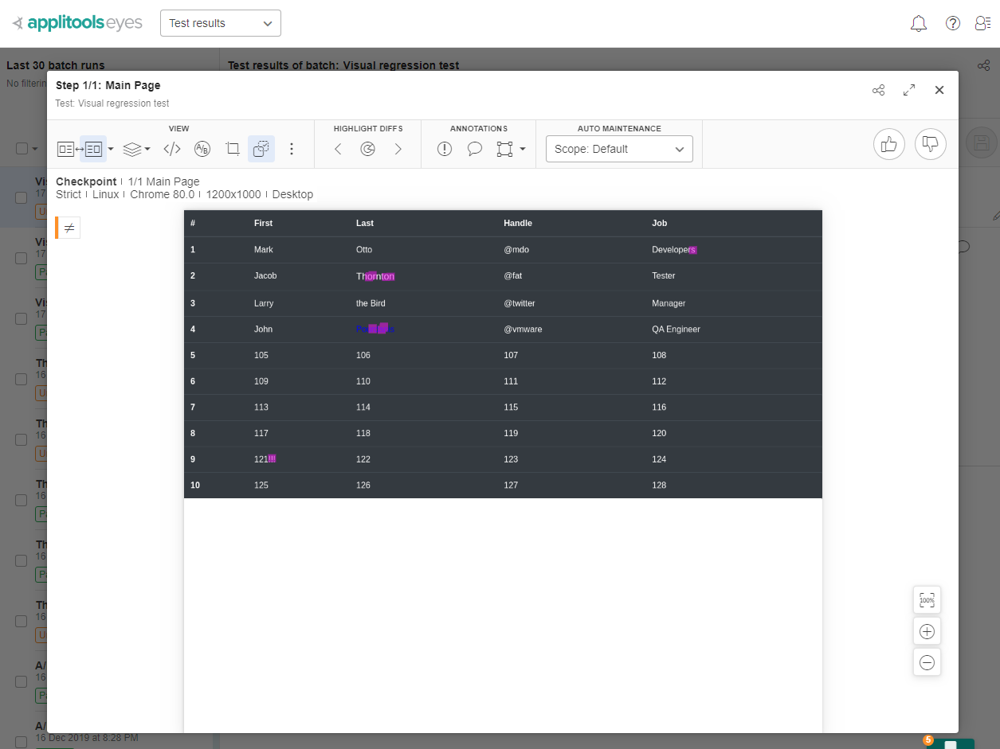

# visual-regression-testing

Here is a sample for visual regression testing . We used cypress for faster results, easy-to-use tooling and headless run!
More info https://www.cypress.io/

### RUN TESTS

1. Run `npm install`
2. Run `npm start` to a thread to start the node server.
3. Run to another thread on command line `npm run test:base`
4. Run `npm run test:actual` 

* All results are under [cypress/snapshots] folder

Note that if you change the host variable on `test:actual` to 'http://localhost:8081/' all tests should pass.

Example: 


### Added Applitools implementation

One of the most famous tools for visual regression testing that use AI is Applitools https://applitools.com/!

1. Run `npm start` to a thread to run the node server.
2. You should set your apikey on `applitools.config.js`. Example
```js
module.exports = {
  apiKey: 'YOUR_API_KEY',
  ...
}
```
3. Run to another thread on command line `npm run applitools:base`
4. Run `npm run applitools:actual`

You should see something like this on the platform :


